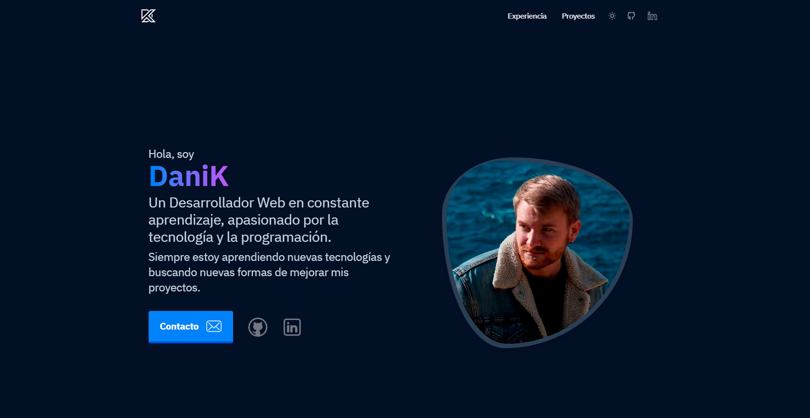

# 🍵 Mi portfolio

He creado mi portfolio con **Astro + Tailwind CSS** para así practicar mis habilidades con un framework y un preprocesador de CSS. 

## Características

- ✅ Integración con **Tailwind CSS** ([@astrojs/tailwind](https://docs.astro.build/en/guides/integrations-guide/tailwind/)).
- ✅ Soporta **modo oscuro**.
- ✅ **Optimización de imágenes** ([@astrojs/images](https://docs.astro.build/en/guides/integrations-guide/image/)).
- ✅ Generación del **sitemap del los proyectos** basado en las rutas ([@astrojs/sitemap](https://docs.astro.build/en/guides/integrations-guide/sitemap/)).
- ✅ **Optimización de fuentes** en tiempo de la built ([subfont](https://www.npmjs.com/package/subfont)).
- ✅ **Accesibilidad y rendimiento**, puntuación en [Lighthouse](https://web.dev/measure/) y en [PageSpeed Insights](https://pagespeed.web.dev/)

<br>



[Live demo](https://danik.dev/) 

<br>

## Estructura de carpetas

```
/
├── public/
│   ├── robots.txt
│   └── favicon.ico
├── src/
│   ├── assets/
│   │   ├── images/
|   |   └── styles/
|   |       └── base.css
│   ├── data/
|   |   └── posts/
|   |       ├── post-slug-1.md
|   |       └── ...
│   ├── components/
│   │   ├── core/
|   |   ├── icons/
|   |   └── widgets/
|   |       ├── Header.astro
|   |       ├── Footer.astro
|   |       └── ...
│   ├── layouts/
│   |   |── BaseLayout.astro
│   |   └── ...
│   ├── pages/
│   |   ├── proyectos/
|   |   |   ├── [...page].astro
|   |   |   └── [slug].astro
│   |   ├── index.astro
|   |   └── 404.astro
│   ├── utils/
│   └── config.mjs
├── package.json
└── ...
```


## Comandos

Todos los comandos se ejecutan desde la raíz del proyecto, desde la terminal:

| Comandos          | Acción                                       |
| :---------------- | :------------------------------------------- |
| `npm install`     | Instala las dependencias                     |
| `npm run dev`     | Inicia el local dev server `localhost:3000`  |
| `npm run build`   | Hace la built de producción `./dist/`        |
| `npm run preview` | Preview de la build en local                 |


<br>

## Roadmap v1.2

- *Portfolio*:
  - Añadir lenguajes y tecnologías conocidas
  - Añadir sección de mini proyectos
- *SEO*:
  - Mejorar la optimización de imágenes
  - Añadir metadatos
  - Mejorar la accesibilidad
- *Proyectos*:
  - Terminar los proyectos pendientes
  - Añadir más proyectos
- *Extra*:
  - Mejorar la documentación
  - Añadir tests
  - Promocionar el portfolio
